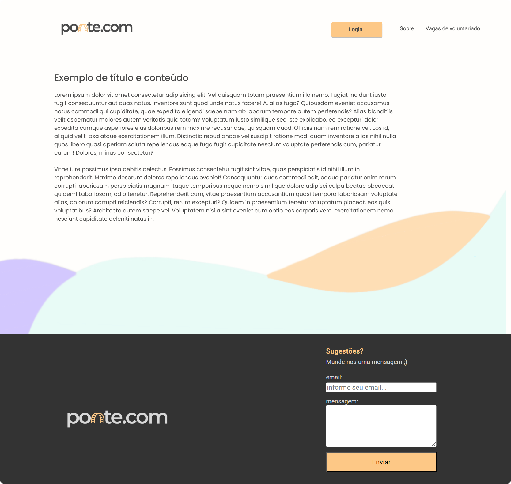
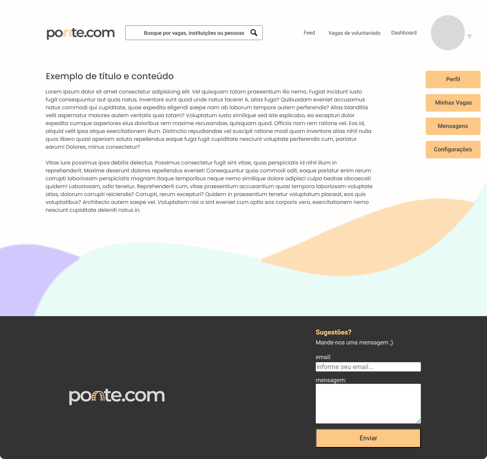

# Template padrão do site

Pré-requisitos: <a href="02-Especificação do Projeto.md"> Especificação do Projeto</a>, <a href="03-Metodologia.md"> Metodologia</a>, <a href="04-Projeto de Interface.md"> Projeto de Interface</a>

De acordo com o projeto de interface elaborado, foi desenhado o template padrão do site. Todas as telas da aplicação possuem uma base de elementos em comum, que se alteram a partir do momento em que o usuário está logado.

Antes do cadastro e/ou login o template apresenta o seguinte design, com uma navbar composta da logo do site e dos botões de "login", "sobre" e "vagas de voluntariado", além de um footer com formulário para sugestões:

 

Após o login, a navbar se altera com a adição de uma barra de pesquisa. Os botões passam a ser de acesso ao "feed", às "vagas de voluntariado" e ao "dashboard". Além disso, é acrescentado um menu dropdown na lateral direita, que abre a partir da foto de perfil do usuário. Neste menu, existem as opções de acessar: "perfil", "minhas vagas", "mensagens" e "configurações". Veja a seguir:

<!-- > Layout padrão do site (HTML e CSS) que será utilizado em todas as páginas com a definição de identidade visual, aspectos de responsividade e iconografia.

> **Links Úteis**:
>
> - [CSS Website Layout (W3Schools)](https://www.w3schools.com/css/css_website_layout.asp)
> - [Website Page Layouts](http://www.cellbiol.com/bioinformatics_web_development/chapter-3-your-first-web-page-learning-html-and-css/website-page-layouts/)
> - [Perfect Liquid Layout](https://matthewjamestaylor.com/perfect-liquid-layouts)
> - [How and Why Icons Improve Your Web Design](https://usabilla.com/blog/how-and-why-icons-improve-you-web-design/) -->
